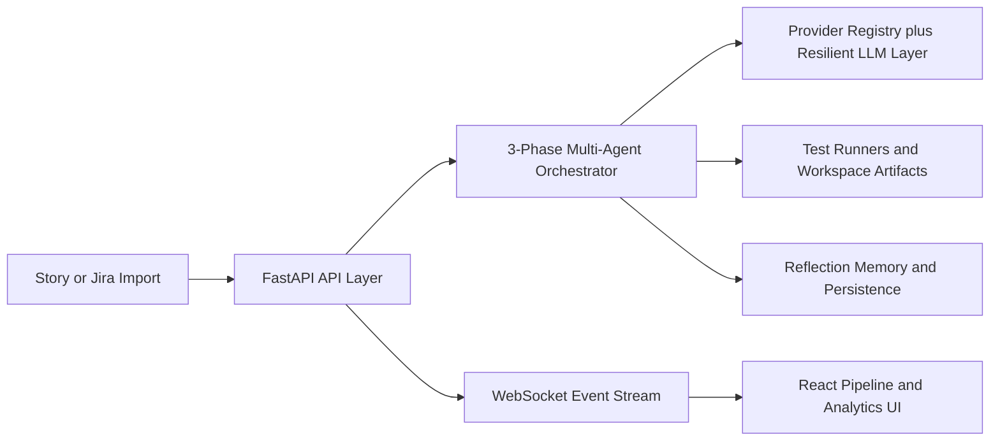

# QArc

QArc is a full-stack AI QA workbench built around a multi-agent testing pipeline. It takes a product story, runs it through specialized analysis and review agents, generates test cases and automation code, executes tests, and surfaces the result through a dense operator-style dashboard.

- A live pipeline view with agent-by-agent output, streaming logs, and execution progress
- Reusable analytics surfaces for stories, test cases, reports, history, and framework settings
- A FastAPI orchestration layer with debate-driven agent flow, provider routing, fallback logic, reflection memory, and real runner integrations

## What Makes This Repo Interesting

### Frontend Product Surface

The frontend is a React 19 + Vite application designed as a real QA control room.


### Backend Orchestration

The backend is a FastAPI application with a 3-phase agent pipeline rather than a flat prompt chain.

1. Analysis phase:
   Story Analyzer -> Test Strategist
2. Generation and review phase:
   Test Case Writer <-> Test Critic debate -> Automation Engineer -> Test Executor
3. Verdict phase:
   Bug Detective <-> Quality Advocate debate -> Coverage Judge

What gives the backend its shape:

- Prompt-driven agents: system behavior lives in markdown prompt files, while Python wrappers stay thin.
- Debate engine: adversarial rounds let one agent produce and another challenge before downstream execution.
- Context summarization: large multi-agent output is compressed between phases to control context growth.
- Reflection memory: past outputs are stored and retrieved with BM25 ranking to inform future runs.
- Provider resilience: agents resolve providers per agent or per tier, then use retry and fallback chains automatically.
- Event streaming: an internal event bus feeds WebSocket clients with pipeline lifecycle events and logs in real time.
- Runner isolation: Playwright and Selenium execution paths are organized around sandbox workspaces, subprocess management, parsers, and artifact collection.

## End-to-End Flow



In practice, the application feels like this:

1. A story is selected from the pipeline UI.
2. The frontend starts a run through the API and subscribes to streaming updates.
3. The backend orchestrates agent execution, debates, context handoff, and test execution.
4. Outputs, metrics, logs, artifacts, and verdict signals flow back into the dashboard, reports, and history views.

## Application Highlights

### Pipeline Experience

- Story picker with acceptance criteria and metadata
- Agent-by-agent status tracking with active output tabs
- Streaming output effect in mock mode and WebSocket-driven live updates in backend mode
- Inline display of generated test cases, automation code, executor results, and live console logs
- Right-rail metrics summarizing progress, pass/fail counts, and agent state

### Analytics and Exploration

- Dashboard with metric cards, trend charts, AI health bars, framework usage, and quality score surfaces
- Test case explorer with story, type, and priority filters
- Agent network page that explains pipeline flow, responsibilities, models, and data handoffs
- Reports view that aggregates generated test data into type distribution, priority distribution, per-story analysis, coverage posture, and agent latency
- Execution history with run filtering, pass-rate bars, and expandable metadata

### Extensibility

- Provider registry for, `ollama`, `openai`, `anthropic`, `groq`, `google`, `azure_openai`, and `bedrock`
- Framework adapter registry on the frontend for Playwright, Selenium, Cypress, Appium, k6, and axe-core
- Backend runner registry for real execution backends
- Jira, GitHub, Slack, and SMTP integration hooks

## Repository Layout

```text
qa-ai/
├── src/                     React frontend
│   ├── components/          Product screens and reusable UI
│   ├── context/             Theme state
│   ├── data/                Mock data for no-backend mode
│   └── lib/                 Config, HTTP layer, service adapters, design tokens
├── backend/                 FastAPI backend
│   ├── app/api/             Route modules
│   ├── app/agents/          Prompt-driven agents and prompts
│   ├── app/orchestrator/    Pipeline, debate engine, summarizer, state
│   ├── app/providers/       LLM provider adapters and resilience layer
│   ├── app/runner/          Sandboxed test execution
│   ├── app/integrations/    Jira, GitHub, Slack, email
│   └── app/memory/          Reflection memory
├── .env.example            Frontend environment template
└── README.md
```

Detailed backend architecture is documented in [backend/README.md](backend/README.md).

## Tech Stack

- Frontend: React 19, Vite, TypeScript, Tailwind CSS v4
- Backend: FastAPI, Pydantic Settings v2, SQLAlchemy async, APScheduler, structlog
- AI providers: Ollama, OpenAI, Anthropic, Groq, Google AI Studio, Azure OpenAI, AWS Bedrock
- Execution layer: Playwright, Selenium, async subprocess orchestration
- Persistence: SQLite for backend data and reflection memory

## Running the Project

### Prerequisites

- Node.js 18+
- Python 3.11+

### Frontend Only: Mock Mode

This mode is great for UI development and demos because the screens still behave like a live system.

```bash
npm install
cp .env.example .env
npm run dev
```

PowerShell equivalent:

```powershell
Copy-Item .env.example .env
```

Then open `http://localhost:5173`.


Start the backend:

```bash
cd backend
python -m venv .venv
.venv\Scripts\activate
pip install -r requirements.txt
cp .env.example .env
uvicorn app.main:app --reload --port 8000
```

On macOS or Linux, activate with:

```bash
source .venv/bin/activate
```

Then start the frontend from the repo root:

```bash
cd ..
npm install
cp .env.example .env
npm run dev
```

Useful URLs:

- Frontend: `http://localhost:5173`
- Backend API: `http://localhost:8000`
- Swagger UI: `http://localhost:8000/docs`

## Configuration Notes

- Provider routing is environment-driven, including per-agent overrides and deep-think vs quick-think tiers.
- Jira, GitHub, Slack, and email integrations are optional and can be enabled independently.

## Current State

The repository already contains substantial end-to-end implementation, but it is still candidly in an active build phase.

- The frontend is polished and works well.
- The backend architecture is broad and thoughtfully modular, with working orchestration, provider, runner, streaming, and integration layers.
- Some service paths still use seeded or in-memory data for the current demo workflow, even though the repository also includes database and repository modules for fuller persistence patterns.

That combination is part of the value here: the repo shows both a strong product prototype and the underlying system design needed to grow it into a production-grade QA platform.

## Documentation

- Backend architecture: [backend/README.md](backend/README.md)
- Frontend app shell: [src/App.tsx](src/App.tsx)
- Frontend service gateway: [src/lib/services.ts](src/lib/services.ts)
- Backend app entry: [backend/app/main.py](backend/app/main.py)
- Pipeline orchestrator: [backend/app/orchestrator/pipeline.py](backend/app/orchestrator/pipeline.py)

## Contributing

Issues and pull requests are welcome. If you are changing orchestration, providers, prompts, or runner behavior, read the backend docs first so the implementation and public docs stay aligned.

## License

There is currently no root `LICENSE` file in this repository. Add one before presenting the project as reusable open-source software under a specific license.
